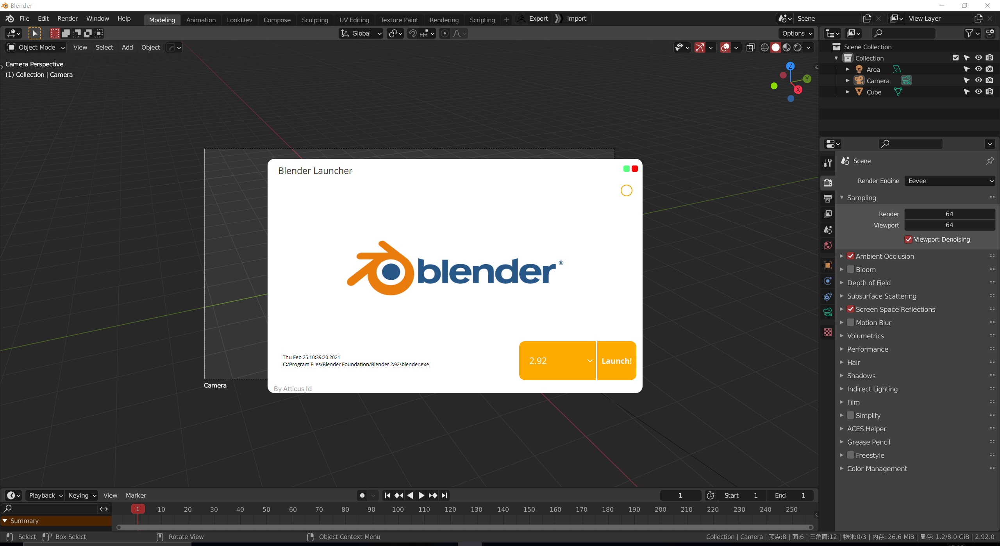
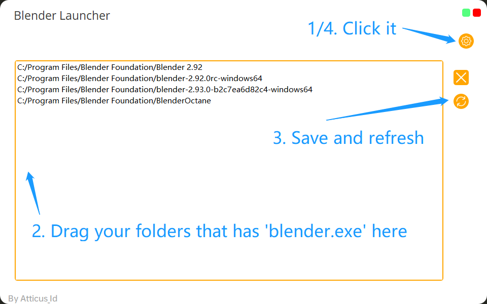

# Blender Launcher

> version 1.0




## Usage

##### Set Preference

1. click the setting icon on top right (the orange circle)

2. drag and drop your blender folder into the box

3. then click the refresh button to save "pref.json" and refresh the home page combobox

4. go back to home page and **LAUNCH!**





#### Manage Paths

remove: select and click the del button

pref file (pref.json)

"0":index that show in the combobox

###### example

```
{
    "0": "C:/Program Files/Blender Foundation/Blender 2.92",
    "1": "C:/Program Files/Blender Foundation/blender-2.92.0rc-windows64",
    "2": "C:/Program Files/Blender Foundation/blender-2.93.0-b2c7ea6d82c4-windows64",
    "3": "C:/Program Files/Blender Foundation/BlenderOctane"
}
```

